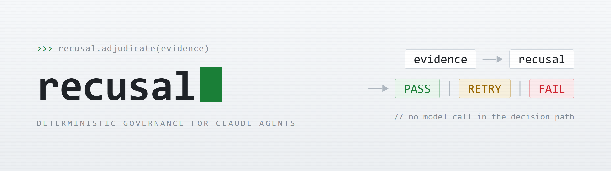
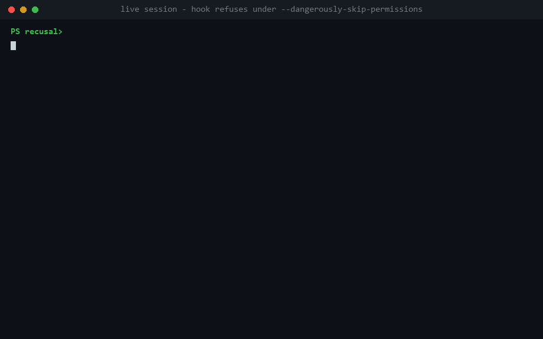

<p align="center">
  <picture>
    <source media="(prefers-color-scheme: dark)" srcset="assets/banner-gate-strip.png">
    
  </picture>
</p>

# Recusal

**Recusal is a deterministic governance gate for Claude and MCP tool calls: it pins the capabilities you approved, detects represented drift, and refuses unsafe, unapproved, or policy-violating actions *before* execution, with no model in the decision path.** A judge recuses themselves from a case they cannot impartially decide; the same principle governs autonomous agents: the thing that generates the work must never be the thing that certifies it.

**Lightweight** (zero dependencies) · **extensible** (a check is just a function that returns a finding) · **Claude-native** (drops into Claude Code as a hook, [MCP tool calls included](#mcp-tools-the-same-gate), and the Claude Agent SDK as a tool gate). The zero-dep core works in any agent loop.

[](https://github.com/philpaz/recusal/actions/workflows/ci.yml)


<p align="center">
  
</p>
<p align="center"><sub>Verbatim transcripts, rendered: a live Claude Code session where the repo's own hook refuses <code>rm -rf</code> under <code>--dangerously-skip-permissions</code>, then the offline demo (<code>python examples/claude_refusal.py</code>), no API key.</sub></p>

## The problem

An autonomous agent proposes a tool call, and then, in most stacks, something from the
same model family effectively decides whether that action is acceptable. When the agent
runs in auto or bypass mode, even that check thins out: what stands between a proposed
`rm -rf`, a wrong-customer write, or an unapproved MCP tool and its execution is the
model's own judgment about its own action.

## What Recusal does

Recusal places deterministic policy between the proposed action and its execution. No
model makes the decision: explicit findings fold into a **`PASS` / `RETRY` / `FAIL`**
verdict, and a non-clean verdict **refuses before the tool runs**. Concretely:

- **A refusal that holds in bypass mode.** A Claude Code `deny` issued from the
  `PreToolUse` seam is honored even under `bypassPermissions`. The honest caveat in the
  same breath: the verdict is produced outside the model's decision path, but deployment
  isolation (who owns `settings.json`, the file permissions, the runtime the gate runs
  on) remains the adopter's responsibility, and the deny-list refuses the obvious
  attempts on its own control paths, including uninstalling or shadowing the `recusal`
  package itself.
- **MCP capability integrity.** Pin the MCP server instructions and tool declarations a
  human approved; `verify` refuses represented drift (the rug pull, the new tool, the
  mutated schema), and the call-time gate refuses any MCP tool that was never pinned.
- **A record built for the auditor.** Every adjudication (defer, allow, deny) can land on
  an append-only, hash-chained log with the proposed input bound by SHA-256 fingerprint:
  deterministic, replayable, stdlib-only, shaped for OWASP Agentic logging and EU AI Act
  Article 12 record-keeping.

The same normalized evidence and policy inputs, under the same recusal version, produce
the same verdict, including the "no".

> Builders generate. Recusal certifies. Refusal is a feature.

## See it refuse (20 seconds, no API key)

```bash
git clone https://github.com/philpaz/recusal && cd recusal
python examples/claude_refusal.py   # a Claude agent stages a write to the WRONG
                                    # customer; the gate refuses before the tool runs
python examples/gallery.py          # the same gate across the OWASP agentic failure modes
```

Deterministic and offline: the same normalized evidence and explicit policy inputs,
under the same recusal implementation version, produce the same verdict, including
the **no**.

## Install

```bash
pip install recusal
```

### Claude Code, drop-in `PreToolUse` hook

Refuse destructive tool calls *before* Claude Code runs them, even in auto / bypass mode.

**One command:**

```bash
python -m recusal init          # or: recusal init
```

scaffolds `.claude/hooks/recusal_gate.py` (the deny-list starter, edit it, it's yours) and
registers the fail-closed launcher in `.claude/settings.json`, merging with (never
clobbering) an existing file; re-running is a no-op, and an existing gate file is never
overwritten. `--posture allowlist` scaffolds the default-deny variant instead. Claude Code
asks you to confirm the new hook on the next session: a permission-changing hook is a
deliberate step.

**Or as a plugin** (one gate across every project, no per-project setup):

```bash
claude plugin marketplace add philpaz/recusal
claude plugin install recusal-gate@recusal
pip install "recusal==0.5.12"   # the plugin is version-bound; fails CLOSED without it
                               # (POSIX launcher: macOS/Linux/Windows-with-Git-Bash)
```

The plugin ships the same deny-list shim; if the `recusal` package is missing it refuses
every tool call rather than silently disabling itself. For a policy tailored to one
project, prefer `python -m recusal init` and edit the scaffolded gate.

For production, pin the runtime the gate runs on: a dedicated venv with
`pip install "recusal==<version>"`, registered explicitly, protected from agent writes.
`pip install recusal` is the quick start, not the governance deployment. (Inside a
governed session, the deny-list refuses package-manager commands that uninstall,
reinstall, or shadow the `recusal` package: managing the gate's own runtime is the
operator's job, outside the session.) One named residual: Claude cancels a command hook
at the platform hook timeout (default 600s), and this repository has NOT independently
established the resulting authorization outcome for the launcher - do not describe hook
timeout as fail-closed until it is tested in your deployment environment. Recusal's
shipped policies adjudicate in milliseconds; keep custom policies fast and bounded.

<details>
<summary><b>The manual path, exit-code semantics, and Windows</b> (what <code>recusal init</code> writes, stated exactly)</summary>

Prefer to see exactly what it writes? The manual path is the same two pieces. Register a
hook in `.claude/settings.json`:

```json
{ "hooks": { "PreToolUse": [
  { "matcher": ".*", "hooks": [
    { "type": "command", "command": "for p in python3 python py; do \"$p\" -c 'import sys; sys.exit(0 if sys.version_info >= (3, 9) else 1)' 2>/dev/null && { \"$p\" \"$CLAUDE_PROJECT_DIR/.claude/hooks/my_gate.py\"; rc=$?; [ \"$rc\" = 0 ] || { echo 'gate: hook did not run cleanly; failing closed' >&2; exit 2; }; exit 0; }; done; echo 'gate: no python>=3.9; failing closed' >&2; exit 2" } ]}
]}}
```

The command runs the first `python3` → `python` → `py` that is `>=3.9` and **fails
closed**. The exit-code semantics, stated exactly: Recusal's normal refusal exits `0`
with `permissionDecision: "deny"` JSON, which Claude honors as a block; a clean verdict
exits `0` with no output and defers to Claude's normal permission flow; exit `2` is
Claude's *blocking failure* signal, and any *other* nonzero exit is a non-blocking
error that lets the tool call proceed. That last rule is why the launcher exists: a
bare `python3` on a Windows machine (no `python3` on PATH), a `python` that is Python
2, or a hook that raises at import would each be a nonzero-but-not-2 failure, i.e. a
silently disabled gate. The loop coerces exactly those gate-process failure modes -
missing interpreter, unsupported interpreter, import failure, nonzero gate-process
exit - into `exit 2`, so they refuse instead of waving the call through. It does not
cover Claude-level hook cancellation or the hook-timeout outcome (above).

**Windows:** shell-form hooks run under Git Bash when it is installed, and Claude Code
*falls back to PowerShell* when it is not - where this POSIX loop is a parse error with a
non-blocking exit code, i.e. the gate silently disables (live-verified). `recusal init`
therefore registers a PowerShell-native launcher with an explicit `"shell": "powershell"`
on Windows; the POSIX form above is for macOS/Linux and Windows-with-Git-Bash. For a
`settings.json` shared across operating systems, `recusal init --launcher both` registers
the pair, and `recusal doctor` validates the registered launcher against the host.

</details>

## Write the policy: two postures, one principle

A policy is a function; the gate does the rest:

```python
# my_gate.py
from recusal import Finding
from recusal.claude_code import run_pretooluse_hook

def policy(tool_name, tool_input):
    if tool_name == "Bash" and "rm -rf" in tool_input.get("command", ""):
        return [Finding.fail("destructive_bash", severity="CRITICAL", message="refusing rm -rf")]
    return []   # no opinion → defer to Claude Code's normal permission flow

run_pretooluse_hook(policy)
```

A clean verdict **defers** (Recusal adds refusals; it never strips Claude Code's own prompts).
A non-clean verdict **denies**, with the reasons. See [`examples/claude_code_gate.py`](examples/claude_code_gate.py).

**Pick the posture by your channel, not by a ranking.**

**Allowlist mode** (default-deny) is the enforcement posture: name the
affirmatively-safe calls, *refuse everything else*. It fits a narrow, enumerable,
high-stakes channel: nothing runs unless listed, and bare interpreters and shell
metacharacters are refused, which closes the documented command-construction and
bare-interpreter bypass classes by construction (pinned as tests). Within a correctly
registered routed tool channel, an unapproved capability is refused by default rather
than inferred safe; what sits outside that channel is named in
[`SECURITY.md`](SECURITY.md). One more honest line: the default-safe tools are
*nonmutating*, not authorized for all data - `cat` can read a credential file - so add
path- and subject-level read rules where confidentiality matters. The trade is friction
and maintenance: you enumerate and grow the capability set, and it fails toward refusal
until you do.

```python
from recusal.claude_code import allowlist_policy, run_pretooluse_hook

run_pretooluse_hook(allowlist_policy(writable_root="./workspace"))
```

The **deny-list** is the low-friction door: name the known-bad calls, *defer everything
else*. It drops into a broad, open-ended channel with almost no friction and needs no
inventory of your tools, which is why this repo dogfoods it (a general-purpose dev repo
runs an unbounded set of legitimate commands). Its boundary is inherent, not a defect: a
literal matcher can be obfuscated past, and `python script.py` runs code no string check
ever reads, so a deny-list never earns "cannot be subverted." Since 0.5.11 it also
refuses package-manager mutation of the enforcement package itself (`pip uninstall
recusal`, install-time shadowing, across the `pip` / `python -m pip` / `uv` spellings;
since 0.5.12 including global option/value forms like `pip --python .venv uninstall`
and `uv --project . remove`, and Windows launcher spellings like `pip.exe`). Protected
names are compared as canonical distribution identities, and a source argument that
merely contains one (`./fake-recusal`) is refused toward safety by contract.

Neither is "better" in the abstract: a deny-list refusing the unknown would grind a broad
channel to a halt, and an allowlist deferring the unknown would defeat the point of a
high-stakes one. Choose by the channel. Both ship, and both are pinned as tests.

> **Don't start from a blank policy.** [`docs/COOKBOOK.md`](docs/COOKBOOK.md) has copy-paste
> recipes (destructive shell, unscoped SQL, secret-file writes, wrong-subject writes, egress
> allowlists, injection quarantine, action budgets) that drop straight into the hook above.

> **Recusal governs *this* repository exactly this way**: a real hook refuses `rm -rf`,
> force-pushes, and secret-file writes to its own maintainers. Verbatim, reproducible,
> CI-locked proof: [`docs/PROVEN.md`](docs/PROVEN.md).

## MCP tools, the same gate

MCP server tools reach Claude Code as ordinary tools (`mcp__<server>__<tool>`), so the
`.*` matcher above already routes every MCP call through the same
`policy(tool_name, tool_input)` seam: no MCP-specific adapter, no extra wiring.
Destructive-operation refusal, repository/record scope, write-path confinement, egress
and action budgets, and the tamper-evident audit record apply to MCP exactly as to
`Bash`; in allowlist mode an MCP tool is **refused unless affirmatively named**.

**The three MCP tool-call boundaries, stated plainly.** A call-time policy adjudicates
the proposed tool name and arguments; MCP has two more boundaries, and Recusal covers
each with its own evidence:

| Boundary | Threat (as the field names it) | Recusal |
|---|---|---|
| Discovery (`initialize.instructions` + `tools/list`) | model-facing server instructions, tool-description poisoning (benchmarked against real-world MCP servers by MCPTox), unapproved capability, post-approval declaration changes (the rug pull), name collisions | **pin + refuse drift**: `recusal mcp pin` / `recusal mcp verify` / `recusal.mcp.manifest_policy` (below) |
| Invocation (the call) | tool misuse (OWASP ASI02), wrong-subject writes (ASI03), exfiltration via tool invocation (MITRE ATLAS AML.T0086) | the call-time policy above |
| Response (the result) | indirect prompt injection in tool output (OWASP LLM01) | quarantine, [cookbook recipe 6](docs/COOKBOOK.md) |

Transport and authorization threats (confused deputy, token passthrough, session
hijacking) are the MCP specification's own Security Best Practices layer, complementary
to this gate, neither replaces the other.

The discovery boundary gets its own deterministic control. The model chooses tools by
reading their declared descriptions, so a poisoned declaration steers the agent *before
any call exists* for a call-time policy to see. Pin what a human approved, then refuse
represented drift:

```bash
recusal mcp pin --claude-config .mcp.json --approve-server-launch   # review once, pin
recusal mcp verify --claude-config .mcp.json --manifest mcp-manifest.json   # CI / session start: same source, instructions, and declarations, or refuse
```

`verify` fails **closed** (a missing manifest or an unreachable pinned server is a
refusal, never a clean-looking pass), and the pin enforces at call time:
`recusal.mcp.manifest_policy("mcp-manifest.json")` refuses any `mcp__server__tool` call
that was never pinned. No pin, no MCP. The honest boundary, in one line: verification is
point-in-time over the configuration artifact you supply, not continuous attestation of
Claude's effective MCP environment; the full statement, with every named residual
(transport, OAuth, plugin runtime identity, `list_changed`, roots), is
[`docs/MCP.md`](docs/MCP.md).

Runnable: [`examples/mcp_governance.py`](examples/mcp_governance.py) and
[`examples/mcp_manifest_rugpull.py`](examples/mcp_manifest_rugpull.py) (both offline).
Recipes: [`docs/COOKBOOK.md`](docs/COOKBOOK.md) §12-§14.

## Tamper-evident audit

Pair any verdict with an append-only, hash-chained log: every decision on the record, and
an in-place edit or reordering of any entry with a surviving successor is detectable
(catching tail-truncation, a tail-suffix rewrite, or a forged append by a write-access
attacker needs an external anchor, see `recusal.audit`):

```python
from recusal import AuditLog, verify

audit = AuditLog(path="audit.jsonl")
audit.append(verdict, action={"tool": "Bash", "command": "rm -rf /"})
ok, problems = verify(audit.entries)   # False if an entry with a later entry was edited/reordered
```

In the Claude Code hook it is one argument: `run_pretooluse_hook(policy,
audit=AuditLog("audit.jsonl", resume="tail"))` puts every adjudication - defer, allow,
and deny - on the chain, with the proposed `tool_input` bound by SHA-256 fingerprint,
never embedded, and an unwritable log failing closed to a deny (the record is part of
the control). Declared `policy_id`/`policy_version` values are caller-supplied labels
unless you separately bind them to a protected source artifact; the record provides
the identifiers needed to locate the policy and evidence for replay, it does not by
itself make arbitrary policy execution replayable. `resume="tail"` recovers the chain
head from the final record without
loading or scanning the full log, and file-backed appends are serialized with an
inter-process lock, so hooks for parallel tool calls extend one chain instead of forking
it.

Deterministic, stdlib-only, and designed to support OWASP Agentic logging and EU AI Act
Article 12 record-keeping: in a regulated deployment, this can provide one auditable
decision artifact within the broader system of records, controls, evidence retention,
and deployment governance.

## Why an independent gate

The reflex fix for agent safety is another model asking "does this action look OK?", but a
judge from the same family shares the builder's blind spots and drifts with it: that is a
conflict of interest, not a control. Recusal is an independent, deterministic authority
instead: no model in the decision path, a verdict you can replay and audit, and a refusal
that holds. "Independent" means the verdict is produced outside the model's decision path;
deployment isolation (who owns the config, the file permissions, the runtime) remains the
adopter's responsibility.

The published evidence (models faking passing tests, benchmarks gamed by intercepting the
evaluator, and the stated limits of Anthropic's own same-family safety layer) is laid out
in [`docs/WHY.md`](docs/WHY.md), every source verified in
[`docs/REFERENCES.md`](docs/REFERENCES.md).

## How it works

One object model, one pipeline. Checks (or your own evidence) produce **Findings**;
`compute_verdict` folds them into a **Verdict**; and the Verdict drives every surface:
the gate refuses, the audit log records, the classifier routes.

```
  data / a proposed agent action / a tool call
          │
     [ checks ]            emit Findings               (recusal.checks, or your own)
          │
   compute_verdict()       fold findings → one Verdict (PASS / RETRY / FAIL)
          │
       Verdict
        │   │   │
        │   │   └─ recusal.classify        route the failure (retry / refuse / ask-human / …)
        │   └───── recusal.audit           tamper-evident, hash-chained record
        └───────── recusal.claude(_code)   allow or refuse the tool call
                   recusal.gates           staged G0-G8 release decision
```

| Module | What it is |
|---|---|
| `recusal.evidence` | the contract, `Finding`, `Verdict`, `Severity`, `Decision`, `compute_verdict` |
| `recusal.checks` | built-in deterministic checks that turn data into Findings |
| `recusal.claude` · `recusal.claude_code` | gate a Claude agent's tool calls (SDK loop, Managed Agents, Claude Code hook) |
| `recusal.deny_list` · `recusal.claude_code.allowlist_policy` | ready-made policies: a reference deny-list (refuse known-bad) and default-deny allowlist |
| `recusal.mcp` · `recusal.mcp_fetch` | MCP tool and server-instruction integrity: pin supported source templates, observed server instructions, and complete tool declarations; refuse represented drift (`diff_observation`); enforce approved runtime tool names at call time (pure kernel); collect a live catalog over stdio (fetcher, the one module that spawns a process). Full boundary statement: [`docs/MCP.md`](docs/MCP.md) |
| `recusal.audit` | tamper-evident, hash-chained log of every verdict |
| `recusal.classify` | deterministic failure classifier + router |
| `recusal.gates` | staged `G0`-`G8` release-gate adjudication, `compute_verdict` at each checkpoint |

Zero runtime dependencies, standard library only.

The verdict, directly:

```python
from recusal import compute_verdict
from recusal.checks import row_count, null_rate, referential_integrity

verdict = compute_verdict([
    row_count(users, min_rows=1),                                  # CRITICAL if empty
    null_rate(users, "email", max_rate=0.10),                      # ERROR if too sparse
    referential_integrity(orders, users, fk="user_id", pk="id"),   # CRITICAL on orphans
])
if verdict.refused:
    raise RuntimeError(verdict.reasons())
```

| Worst finding | Verdict | Meaning |
|---------------|---------|---------|
| `CRITICAL` failure | **`FAIL`** | Terminal. The work is wrong. Do not retry. |
| `ERROR` failure | **`RETRY`** | Recoverable. Retry once, with the failures as context. |
| `WARNING` / `INFO` only | **`PASS`** | Proceed. Warnings recorded, info kept as metrics. |

## How Recusal fits into Claude Code

Recusal uses `PreToolUse`, Claude Code's native pre-execution policy seam, and it is
intentionally ONE layer in a broader control stack, not a replacement for the others.
Claude native permissions own broad allow/ask/deny rules (a native deny applies
regardless of any hook decision). Claude sandboxing constrains what an allowed command
can touch after it runs. Managed settings own organization-controlled policy, hook
distribution, and MCP server restrictions (`allowedMcpServers` is how an enterprise
bounds the effective server set). Claude MCP configuration owns transport, OAuth,
credentials, and endpoint connectivity. Recusal owns deterministic evidence
adjudication: explicit findings become `PASS`/`RETRY`/`FAIL` with no model in the
decision path, a clean verdict defers to Claude's remaining permission flow by default,
and a non-clean verdict denies before execution. The strongest deployment is layered:

```
  managed settings configure the allowed control surface
      tool proposal  ->  Recusal PreToolUse adjudication  ->  Claude native
      permission rules and prompt  ->  Claude sandbox / OS boundary
      ->  approved tool or MCP execution
      (audit records the Recusal decision separately, externally anchored)
```

The diagram shows execution order (`PreToolUse` runs before the permission prompt);
enforcement precedence is deny-wins across the hook and native permission layers - a
native deny applies regardless of any hook decision, and a blocking hook takes
precedence over a native allow.

### Claude Agent SDK, manual loop

In a manual agent loop, gate each tool call and hand Claude an `is_error` tool_result on a
refusal; it self-corrects:

```python
from recusal.claude import gate_tool_use

allow, refusal = gate_tool_use(tool.id, gather_evidence(tool), tool_name=tool.name)
if not allow:
    results.append(refusal)                          # is_error=True → Claude adapts
else:
    results.append({"type": "tool_result", "tool_use_id": tool.id,
                    "content": execute_tool(tool.name, tool.input)})
```

Runnable: [`examples/claude_agent_live.py`](examples/claude_agent_live.py) (real API) and
[`examples/claude_refusal.py`](examples/claude_refusal.py) (offline, no key). For **Managed
Agents** `always_ask`, `recusal.claude.tool_confirmation` is the deterministic decider
(the SDK event shape is illustrative; verify it against your Agent SDK version).

### Any agent loop, no Claude required

The Claude adapters are conveniences; the zero-dep core is framework-neutral.
[`examples/agent_loop.py`](examples/agent_loop.py) gates a plain `propose → gate → act`
loop whose only import is `recusal`; the same `compute_verdict` seam drops into LangGraph,
the OpenAI Agents SDK, or a homegrown runtime unchanged.

## Robustness, across the OWASP Agentic failure modes

`python examples/gallery.py` runs the gate against the common autonomous-agent failure modes:

```
  scenario                OWASP                 verdict outcome
  wrong-subject write     ASI03 Identity Abuse  FAIL    REFUSE
  destructive file delete ASI02 Tool Misuse     FAIL    REFUSE
  unscoped SQL mutation   ASI05 Code Execution  FAIL    REFUSE
  data exfiltration       ASI01 Goal Hijack     FAIL    REFUSE
  coverage floor          quality gate          RETRY   BLOCK (retry)
  runaway action volume   ASI08 Cascading       RETRY   BLOCK (retry)
  compliant write         -                     PASS    ALLOW
```

The tiers are the policy: destructive things REFUSE terminally; recoverable ones BLOCK
with a retry; a clean call passes. (Same policies power the demo and the test suite.)

## Gate your CI

CI is, by construction, not the session that did the work, which makes it the natural
place for a recusal verdict. The same kernel runs as a command line with blocking exit
codes (`PASS` 0, `RETRY` 1, `FAIL` 2; any operational error exits 2, failing **closed**):

```bash
recusal verdict findings.json --json   # adjudicate any tool's findings; nonzero blocks the job
recusal audit verify audit.jsonl --expect-head "42:<hash>"   # a missing log is NOT an intact log
recusal doctor                         # "the gate silently isn't installed" fails CI, not prod
```

Or as a GitHub Action ([`action.yml`](action.yml), dogfooded by this repo's own CI,
including the negative case: a tampered audit log must make the gate refuse):

```yaml
- uses: actions/setup-python@v6
  with:
    python-version: "3.12"
- uses: philpaz/recusal@v0.5.12   # or pin an immutable commit SHA for stronger provenance
  with:
    findings: reports/findings.json   # RETRY exits 1, FAIL exits 2 → the merge is blocked
    audit-log: reports/audit.jsonl
    doctor-dir: "."
```

The action ref selects the implementation: the action force-installs the recusal bundled
with the selected ref, replacing whatever happens to be on the runner, so pinning the
action pins the code (proven in CI on a clean runner and against a deliberately
conflicting preinstall). The two escape hatches are explicit inputs that name the
provenance trade: `version:` installs a named PyPI release, and `use-installed: "true"`
keeps a deliberately preinstalled checkout.

Given nothing to adjudicate, the action exits 2 rather than pass vacuously: an evidence
set that proves nothing certifies nothing.

## Classify and route a failure

A refusal or failure is only useful if you know what to do next. The classifier says
*what kind* of failure it is and where it routes, deterministically, with no model:

```python
from recusal import classify_failure

c = classify_failure("Traceback ... TypeError: 'NoneType' object")
c.failure_class   # "code_bug"
c.route           # "fix-code"
```

Default taxonomy (extend or replace it): `transient → retry` · `policy_violation → refuse` ·
`prompt_injection → quarantine` · `code_bug → fix-code` · `data_shape → fix-data` ·
`data_missing → fetch-data` · `spec_ambiguity → ask-human`. Unmatched failures fall back to
`ask-human`; it never guesses. `classify_verdict(verdict)` routes a non-PASS verdict.

## Documentation

**New here?** The quick objections (*do I need this? doesn't Claude already do it? is it
ready to use?*) are answered in the [`docs/FAQ.md`](docs/FAQ.md). The plain-terms "so
what": [`docs/WHY.md`](docs/WHY.md).

**Full documentation index: [`docs/`](docs/README.md).** MCP governance in full,
boundaries and residuals included: [`docs/MCP.md`](docs/MCP.md). Comparison with the
landscape: [`docs/LANDSCAPE.md`](docs/LANDSCAPE.md). The principles and why each helps:
[`CONSTITUTION.md`](CONSTITUTION.md). The contract: [`docs/EVIDENCE.md`](docs/EVIDENCE.md).
Usage & extending: [`docs/HOWTO.md`](docs/HOWTO.md) · [`docs/EXTENDING.md`](docs/EXTENDING.md).
Copy-paste policies: [`docs/COOKBOOK.md`](docs/COOKBOOK.md).
A full worked configuration: [`docs/EXAMPLE.md`](docs/EXAMPLE.md).
Proof it governs itself: [`docs/PROVEN.md`](docs/PROVEN.md).

## Development

```bash
pip install -e ".[dev]"
pytest -q
```

## Contributing

Contributions are welcome. Recusal is deliberately small, and the bar is keeping it that
way (no model in the verdict path, no runtime dependencies, don't grow the kernel). Read
[`CONTRIBUTING.md`](CONTRIBUTING.md) and the [`CODE_OF_CONDUCT.md`](CODE_OF_CONDUCT.md)
first. Security reports go through [`SECURITY.md`](SECURITY.md), privately.

## Contact

Built by [Philip Paz](https://www.linkedin.com/in/philippaz/). Messages are open,
especially from teams running agents in regulated environments, and doubly so if you
wired the gate in and found where it leaks
([tell me here](https://github.com/philpaz/recusal/discussions/1)).

## License

Apache-2.0 © [Philip Paz](https://www.linkedin.com/in/philippaz/)
